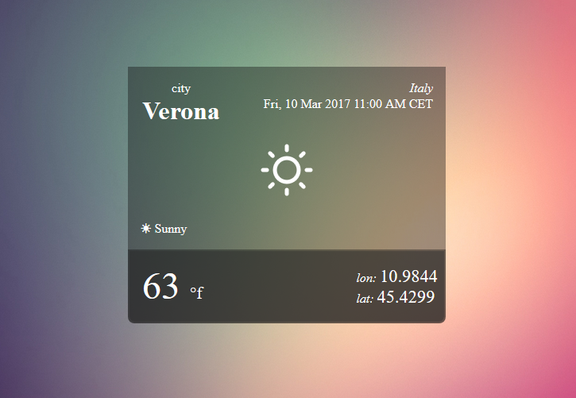

# Golang-Simple-Weather-App

A quick example on how to process a request's IP address to show weather information in a very simple golang application
The app will use the GeoLite2.mmdb database to retrieve the location of a given IP address, which will be fed to a yahoo yql to retrieve weather info from the specified location inside the database
It will also display different style themes depending on the hour of the user's day and will be responsive at different screen sizes / orientation

While the retrieved GeoLite position wont be accurate enough for any serious project, it behaves well as a little webpage widget to show wheater info in non-https pages without requiring user input to communicate it's position

Further dependecies used for this particular repo are:
• https://github.com/abh/geoip
• https://github.com/tidwall/gjson
